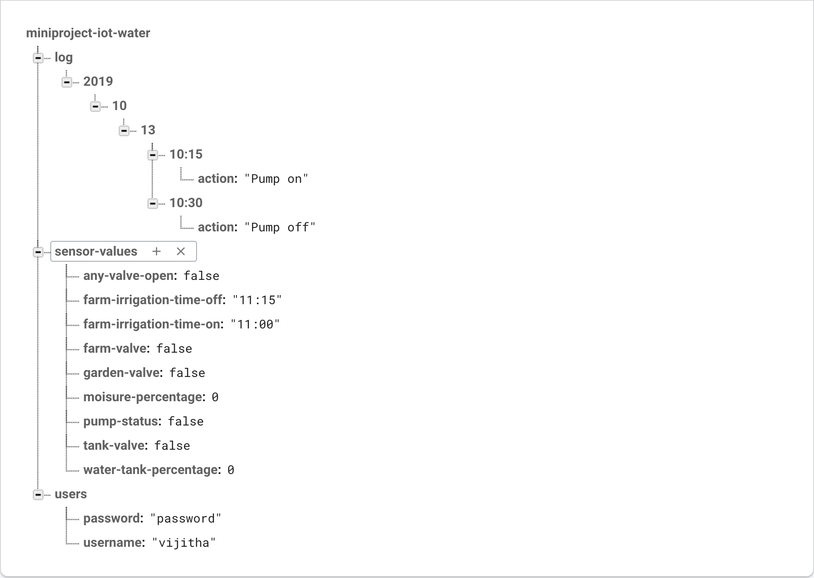

# IOT Based Water Level Indicator

## Introduction

The IOT based Water Level Indicator is the mini project under MCA course. The user can get water level through mobile app and web interface. The project is well suited for the following scenario:-

1. one pump for all action; tank, sprinkler for farm and garden.
2. valve locking system (One valve at a time).
3. Use of moisure sensor for garden.
4. Time based watering for farm.
5. Need info on display, Android app and Web app.

The following image is the prototype of the project.

## Features

1. Realtime water level, pump status and value status.
2. Web interface and android app.
3. Manual remote control pump control.
4. Automatic sprinker system according to moisure content.
5. LCD display for showing status.
6. Show system log on Android app and Web app.

## Hardware modules

1. Main board module.
2. Water tank module.
3. valve switching module.

### Main board Module Components

1. Raspberry Pi Zero W
2. Relay (220V - 5V)
3. LEDs - 2 (Red & green)

### Water Tank Module Components

1. Touch pads - 5
2. Ultrasonic sensor - 1
3. Atmega328p - 1

### Valve Switching Components

1. Solenoid valve - 3
2. Atmega328p - 1

Notes:-

1. The communication between the modules is via I2C communication.
2. All the data is stored in firebase.

## Project Design

## Libraries

### tank Module

1. wire.h - for I2C communication

### valve Modulex

1. wire.h - for I2C communication

### Main Module

1. RPi_I2C_driver library (included with code) - for LCD
2. RPi.GPIO library - for GPIO
3. os - for running bash commands
4. subprocess - for getting values from bash commands
5. time - for sleep related functions
6. datetime - for detecting current date and time
7. pyrebase - for firebase connectivity
8. socket - for working with web requests

## Firebase Database Design

## Files and folders explained

### Folders

1. documentation/abstract: contains the project abstract.
2. documentation/Diagrams: contains important figures drawn using draw.io, fritzing designs and exports and firebase design.
3. project-reviews/Zeroth-review-presentation: contains presentation done for zeroth review.
4. project-reviews/first-review: contains user stories submitted in first review.
5. src - Contains the source code.
   1. android-app: contains the code for android app.
   2. main-board-module: contains code for Raspberry Pi Zero W.
   3. tank-module: contains embedded C code for Atmega328p. This micro-controller will be placed at water Tank.
   4. valve-switching-module: conatins embedded C code for ATmega328p. This micro-controller will be placed at the main pipeline junction.
6. diagnostics: code to test each sensors used in the project.

### Diagnostics

The diagnostics include:-

1. Main board
   1. I2C communication
   2. Internet status
   3. LCD display
   4. LED control
   5. Relay control
2. Tank control
   1. I2C communication
   2. Touch pads
   3. Ultrasonic sensor
3. Valve control
   1. I2C communication
   2. Moisure sensor
   3. Solenoid valve

## Setup Development Environment

### Install Raspberry Pi Requirements

1. Install python3 requirements.
   `sudo pip3 install requirements.txt`

### System process settings

To make the python code run at boot as background. Follow the following steps:-

1. Edit rc.local as adminstrator.

   `sudo nano /etc/rc.local`

2. Add internetStatus.py python program to run at boot as background process along with astrik(&) symbol.

   `sudo python3 /home/pi/CET-MCA-S5-MiniProject-IOT_based_Water_Level_Indicator/diagnostics/main-board/internetStatus &`

3. Save the rc.local file.
4. Reboot

## To Do

1. Include firebase to android app.
2. Develop web app.
3. User authentication for Webapp.

## Contributors

1. [Sashwat K](https://www.sashwat.in/)
2. [Vijitha V Nair](https://github.com/vijimalu)
